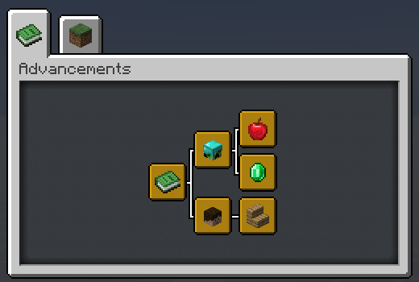
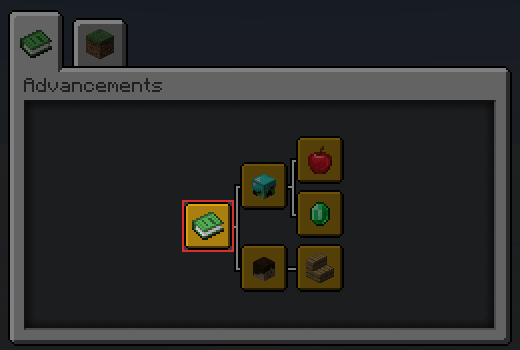
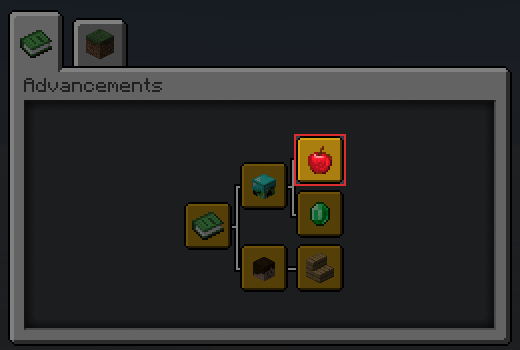

# แอดวานซ์เม้นท์ดาต้าแพค (`*`)

## เกี่ยวกับ

แบบแผนนี้มีวัตถุประสงค์เพื่อแสดงข้อความการติดตั้งดาต้าแพคให้ดูได้ง่ายและไม่ยุ่งยากกับผู้ใช้โดยใส่มันไว้ที่แท็บแอดวานซ์เม้นท์เดียว

## ชมตัวอย่าง

นี่คือตัวอย่างคร่าวๆของแบบแผนนี้



## การใช้งาน

แบบแผนนี้แบ่งออกเป็น 3 ส่วน: `Root`, `Namespace` และ `Datapack`

## 1. Root Advancement

นี่คือจุดเริ่มต้น Advancement ของทุกๆดาต้าแพคที่จะแยกสายออกมาจากข้อนี้ 



ไฟล์ Advancement นี้จะ **ต้อง** อยู่ที่ไฟล์ `/data/global/advancements/root.json`

```json
{
    "display": {
        "title": "Installed Datapacks",
        "description": "",
        "icon": {
            "item": "minecraft:knowledge_book"
        },
        "background": "minecraft:textures/block/gray_concrete.png",
        "show_toast": false,
        "announce_to_chat": false
    },
    "criteria": {
        "trigger": {
            "trigger": "minecraft:tick"
        }
    }
}
```

## 2. Namespace Advancement

นี่คือ Advancement หัวของผู้สร้าง (player_head) แต่ละดาต้าแพค 

ซึ่งทุกๆของคุณดาต้าแพคจะเหมือนกันหมด ซึ่งมัน **ต้อง** อยู่ที่ไฟล์ `/data/global/advancement/<namespace>.json`.

```json
{
    "display": {
        "title": "<Your name>",
        "description": "",
        "icon": {
            "item": "minecraft:player_head",
            "nbt": "{SkullOwner: '<your_minecraft_name>'}"
        },
        "show_toast": false,
        "announce_to_chat": false
    },
    "parent": "global:root",
    "criteria": {
        "trigger": {
            "trigger": "minecraft:tick"
        }
    }
}
```

> **หมายเหตุ**  
> ถ้าคุณทำเขียนดาต้าแพคแล้วมีคนช่วยหลายคนคุณสามารถเลือกใช้ได้ดังนี้ :
> - แสดงผลแบบ "ชื่อของคุณเอง" และให้เครดิตคนในทีมด้วยวิธีอื่น เช่น เพิ่มที่คำอธิบาย, ตัวเลือกหรือการตั้งค่าในส่วนของเมนูเกี่ยวกับ เป็นต้น
> - แสดงผลแบบ "ชื่อทีม" ที่คุณเลือกกันในทีม
> - แสดงผลแบบ "[ดาต้าแพคชุดเดียว](#พิเศษ-ดาต้าแพคชุดเดียว)" แทน.

## 3. Datapack Advancement

นี่คือ Advancement สำหรับแสดงผลการติดตั้งและข้อมูลดาต้าแพคของคุณ มันควรอยู่เดี่ยวๆจากดาต้าแพคอื่นๆ



คุณสามารถสร้างมันที่ไหนก็ได้ แต่ไม่ใช่ที่ โฟลเดอร์ `/data/global/advancements/folder` ซึ่งผมแนะนำว่า `/data/namespace/advancement/datapack_name/<datapack_name>.json`

```json
{
    "display": {
        "title": "<datapack name>",
        "description": "<datapack description>",
        "icon": {
            "item": "<item>"
        },
        "announce_to_chat": false,
        "show_toast": false
    },
    "parent": "global:<namespace>",
    "criteria": {
        "trigger": {
            "trigger": "minecraft:tick"
        }
    }
}
```

### หมายเหตุ

ทุกอย่างที่อยู่ใน `<...>` ควรเปลี่ยนเป็นข้อมูลตามที่เขียนระบุไว้

## ผลลัพธ์

แท็บ Advancement ของคุณในตอนนี้มันควรจะเป็นแบบนี้ดังภาพ:

  
(Image by @Hashs#9531)

## พิเศษ: ดาต้าแพคชุดเดียว

รูปแบบของตัวเลือกนี้คุณสามารถใช้ได้หากคุณต้องการแสดงเส้นสายแอดวานซ์เม้นท์ของดาต้าแพคแบบชุดเดียว *โดยไม่มี* หัวของผู้สร้าง/เขียน

การใช้งานนี้คุณข้ามขั้นตอน [#2: Namespace Advancement](#2-namespace-advancement) ไปได้และให้มั่นใจว่าในขั้นตอน [#3: Datapack Advancement](#3-datapack-advancement) คุณสร้างไฟล์ไว้ที่ไดเรกเทอรี่ `/data/global/advancements/standalone/` 

> โปรดทราบว่าหากคุณมีแผนจะทำดาต้าแพคเพิ่มขึ้น คุณควรใช้รูปแบบปกติ